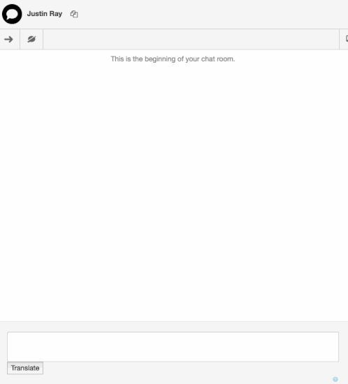

# Cloud 9

**Awarded _Honourable Mention_ (4th place) by a panel of Sr. Software Engineers from Genesys**

**Description**: A Google Chrome extension built upon the PureCloud platform which enables a customer contact agent to communicate with any customer, regardless of language. Cloud 9 allows an agent to read and prepare a response in a language familiar to themselves then translate and respond in the original language used by the customer.

**Technologies**: Cloud 9 was built with HTML, jQuery, Node.js, Express.js and utilized IBM Watson to provide accurate, real-time translations.

**Team Members**: [Vimal Raghubir](https://github.com/Vimal-Raghubir), [Mera Gangapersaud](https://github.com/Mera-Gangapersaud) and [Sean Prashad](https://github.com/SeanPrashad).

**Project Photos**:

